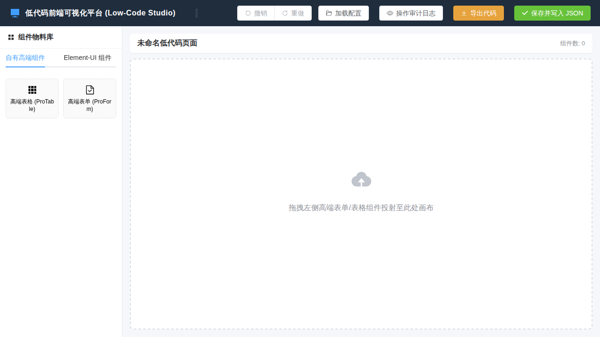

# 低代码前端可视化平台 (Low-Code Frontend Platform)

> 高性能、高可扩展性、高度模块化的企级 Vue 3 低代码可视化前端搭建平台与出码引擎。



---

## 📖 项目简介

本项目旨在打造一款可通过**可视化拖拉拽**快速生成 Vue 3 页面、原生 Web Components 自定义元素或纯 HTML 独立 Bundle 的低代码平台。平台采用**完全解耦的架构设计**，以 **JSON Schema 为唯一映射桥梁**，连接 UI 组件、RESTful API 接口与事件动作链条。

项目采用了 **Node.js + Express + SQLite** 架构，其中页面/组件的 Schema 配置文件**直接存储为本地 `.json` 文件**，而 SQLite 数据库专用于记录高可靠的**操作审计日志 (Operation Audit Logs)**。

---

## ✨ 核心特性

- **可视化网格布局引擎**：集成 `vue3-grid-layout-next` 拖拽画布，支持组件拖投放置、自由缩放拉伸、自动响应式网格布局。
- **丰富的分类物料库**：
  - **自有高端组件 (Pro Components)**：`高端表格 (ProTable)`（支持列可视化定义、排序、分页、操作列按钮）、`高端表单 (ProForm)`（支持多列布局、多类型表单控件与必填校验）。
  - **Element-UI 组件 (Native UI Components)**：`按钮 (Button)`、`输入框 (Input)`、`卡片 (Card)`、`标签 (Tag)`、`警告提示 (Alert)`、`开关 (Switch)`、`分割线 (Divider)` 等。
- **可视化属性配置抽屉 (Property Drawer)**：
  - **属性 Props**：实时修改组件外观与原生属性。
  - **高级 Config**：动态可视化增删/重排表格列定义及表单项。
  - **原生 Attrs**：动态透传原生 HTML 属性。
  - **JSON 源码预览**：实时生成并渲染对应 Schema，支持一键复制。
- **存储与审计解耦架构**：
  - **JSON 文件直接存储**： Schema 数据写入后端 `storage/pages/{page_id}.json`，实现极佳的人类可读性与无缝 Git 版本追踪。
  - **SQLite 审计留痕**：所有的修改、保存与删除操作均自动落盘至 SQLite 操作日志表（`logs.db`）。
- **多目标零废码出码引擎**：一键生成纯正 Vue 3 SFC (`.vue`) 源码，或编译导出为 W3C 标准原生 Web Components（跨 React/jQuery/JSP 复用）与独立 HTML+JS 静态 Bundle。
- **极佳的代码规范与组件解耦**：代码工整，严格遵循单职责原则 (SRP) 与 TypeScript 强类型标注。

---

## 🏗️ 架构设计哲学 (Architecture)

### 1. JSON 桥梁模型 (The JSON Bridge Concept)
平台通过监听用户的拖拉拽与属性配置操作，实时构建并维护一个可序列化的 **JSON 树**。JSON 既是视图渲染的凭证，也是连接组件、接口与事件的唯一桥梁。

核心属性 Key 规范：
- `id`: DOM ID 与画布节点的全局唯一标识。
- `component`: 对应的 UI 组件 / 物料类型。
- `name`: 对应的表单项属性 / 数据绑定 Key。
- `click`: 点击等原生与组件交互事件规则。
- `functions`: 对应作用域/域下的逻辑处理函数与业务脚本。

### 2. Component - API - Event (CAE) 三角解耦模型
```text
                     +----------------------------------+
                     |        页面全局状态中枢          |
                     |       (Pinia / Reactive State)   |
                     +----------------------------------+
                                ▲            │
             状态监听 / 参数映射  │            │ 驱动重新渲染 / 属性透传
                                │            ▼
       +--------------------------------------------------------------+
       |                                                              |
       |  【组件层: Component Node】  ◄───────  【接口层: API Data】  |
       |  - ProTable (高端表格)                 - RESTful / GraphQL   |
       |  - ProForm (高端表单)                  - JSON Path 提取      |
       |  - Element UI 元素                      - 入参 / 出参转换     |
       |                                                              |
       +--------------------------------------------------------------+
                                ▲            │
                      抛出事件  │            │ 执行动作链
                      (Event)   │            ▼ (Action Chain)
                       +--------------------------------+
                       |   【事件动作层: Event/Action】  |
                       |   - Event Trigger              |
                       |   - Action Dispatcher          |
                       |   - Event Flow Orchestrator    |
                       +--------------------------------+
```

---

## 🛠️ 技术栈选型

| 层级 | 技术选型 | 版本/组件 | 说明 |
| :--- | :--- | :--- | :--- |
| **前端框架** | Vue 3 | `3.4+` | Composition API 及 `<script setup>` 范式 |
| **UI 组件库** | Element Plus | `2.x` | 企级 UI 物料与高端表单/表格 |
| **拖拽布局引擎** | vue3-grid-layout-next | `1.x` | 基于栅格网格的可伸缩拖拽布局插件 |
| **状态管理** | Pinia | `2.x` | 响应式 Store，管理设计器全局 Schema 状态 |
| **前端构建** | Vite | `5.x` | 极速冷启动与 HMR 构建工具 |
| **后端运行环境**| Node.js | `18+` / `22+` | JavaScript 运行环境 |
| **后端 Web 框架**| Express | `4.x` | RESTful API 服务框架 |
| **JSON 文件存储**| Node File System | `fs/promises` | 持久化存储 Schema JSON 配置文件 |
| **日志数据库** | SQLite | `better-sqlite3` | 本地轻量级审计日志数据库 |
| **工程化 & 规范**| TypeScript | `5.x` | 强类型标注与语法检查 |

---

## 📂 项目工程目录结构

```text
low-code-platform/
├── docs/                     # 项目规划与架构技术规范文档集
│   ├── 0.0.1_PLAN.md         # 0.0.1 基础里程碑规划文档
│   ├── 0.1.0_PLAN.md         # 0.1.0 接口数据源、传参映射与事件动作规划
│   ├── COMPONENT_API_EVENT_MAPPING.md # 组件、接口、事件三角解耦技术规范
│   └── ARCH_RECOMMENDATIONS.md # v2.0.0 干净源码生成器/沙箱/撤销历史栈演进建议
├── frontend/                 # Vue 3 前端低代码设计器工程
│   ├── src/
│   │   ├── components/       # 设计器 UI 组件 (CanvasContainer, MaterialList, PropertyDrawer)
│   │   ├── registry/         # 物料注册中心 (materials.ts)
│   │   ├── stores/           # Pinia 全局设计器 Store (designerStore.ts)
│   │   ├── types/            # TypeScript 类型定义
│   │   └── App.vue           # 极简主应用与 API 联调界面
│   ├── package.json
│   └── vite.config.ts
├── backend/                  # Node.js + Express 后端服务工程
│   ├── src/
│   │   ├── controllers/      # JSON Schema CRUD 与日志控制器
│   │   ├── db/               # SQLite logs.db 初始化脚本
│   │   ├── services/         # 文件读写存储服务 (storageService.ts)
│   │   └── server.ts         # Express 服务入口
│   ├── storage/              # JSON 文件持久化存储目录
│   │   ├── pages/            # 页面配置 JSON 集合 (*.json)
│   │   └── components/       # 组件配置 JSON 集合 (*.json)
│   ├── data/                 # SQLite 数据库存储目录 (logs.db)
│   ├── package.json
│   └── tsconfig.json
├── package.json              # Root Monorepo 脚本
└── README.md
```

---

## 🚀 快速开始与开发指南

### 1. 安装依赖
```bash
# 在项目根目录下安装所有 Workspaces 依赖
npm install
```

### 2. 启动开发服务器
```bash
# 启动后端 REST API 服务 (运行于 http://localhost:3001)
npm run dev:backend

# 启动前端 Vite 低代码设计器 (运行于 http://localhost:5173)
npm run dev:frontend
```

### 3. 构建与打包
```bash
# 对前端与后端同时进行 TypeScript 类型检查与生产编译打包
npm run build
```

---

## 🔌 后端 RESTful API 接口定义

| 请求方式 | 路径 | 描述 | 参数 / Body |
| :--- | :--- | :--- | :--- |
| **GET** | `/api/schemas` | 获取页面/组件 JSON 列表 | `?type=page` 或 `?type=component` |
| **GET** | `/api/schemas/:id` | 读取指定 ID 的 Schema 内容 | `?type=page` |
| **POST** | `/api/schemas` | 保存 Schema 至本地 `.json` 文件并记录 SQLite 日志 | Body: `PageSchema` JSON 对象 |
| **DELETE**| `/api/schemas/:id` | 删除 Schema 配置文件并记录 SQLite 日志 | `?type=page` |
| **GET** | `/api/logs` | 查询 SQLite 操作审计日志 | `?pageId=xxx` (可选) |

---

## 📄 文档索引 (Documentation Index)

所有的详细规划、技术架构标准与演进建议均存放于 `docs/` 目录：
1. **[0.0.1 里程碑规划](docs/0.0.1_PLAN.md)**：包含基础拖拽、属性面板与双存储方案。
2. **[0.1.0 接口与事件联动规划](docs/0.1.0_PLAN.md)**：包含 API 数据源绑定、参数映射与事件动作链条。
3. **[Component - API - Event 三角解耦规范](docs/COMPONENT_API_EVENT_MAPPING.md)**：包含完整的 Schema 契约与 JSON 桥梁模型。
4. **[架构演进与体验优化深度建议](docs/ARCH_RECOMMENDATIONS.md)**：包含零废码源码生成器、沙箱预览、时间旅行撤销历史栈、远程物料插件与规则引擎的落地方案。
5. **[平台演进与优化方向指南](docs/FUTURE_DIRECTIONS.md)**：包含画布标尺/快捷键/嵌套容器、动态 JS 表达式、纯 Vue 3 SFC 出码、SQLite 版本对比回滚与 Module Federation 远程物料插件等 10 大演进方向。
6. **[v0.2.0 已实现功能问题排查与优化报告](docs/0.2.0_OPTIMIZATIONS.md)**：包含 Web Component Shadow DOM 样式穿透、RFC 6902 JSON Patch 增量保存、历史栈 GC 优化、快捷键上下文隔离与 Prettier 代码美化解析器落地方案。
