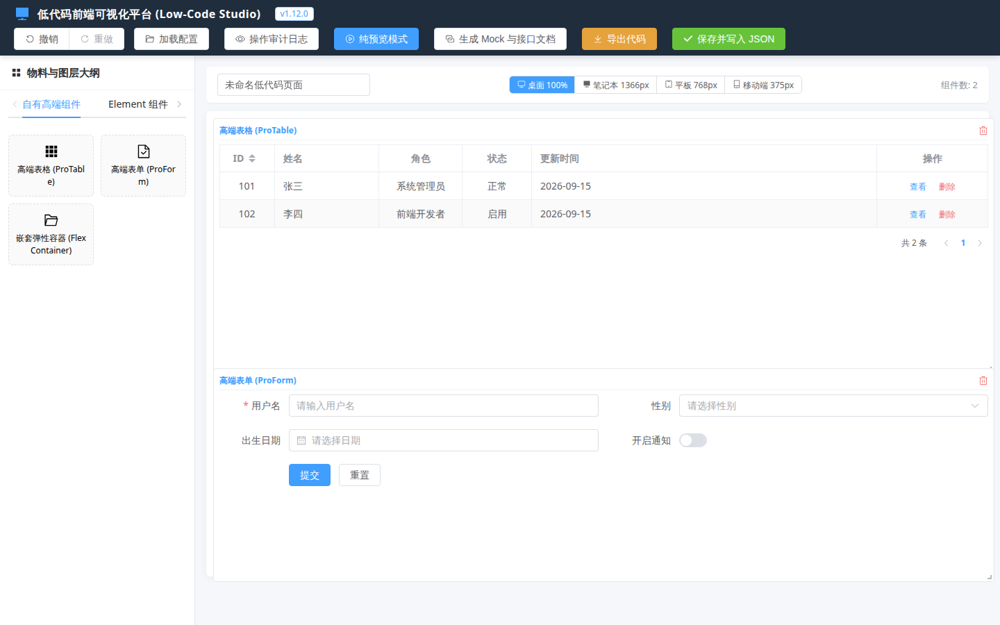
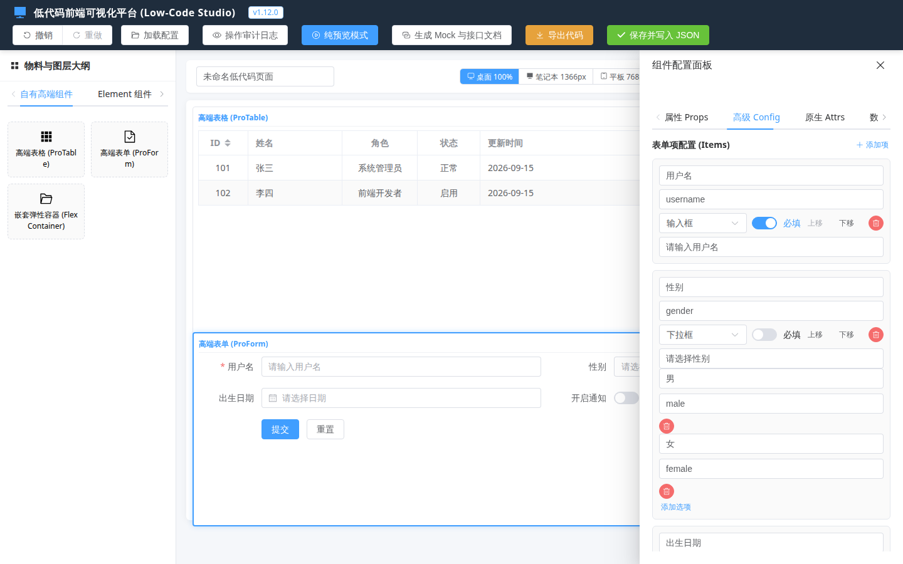
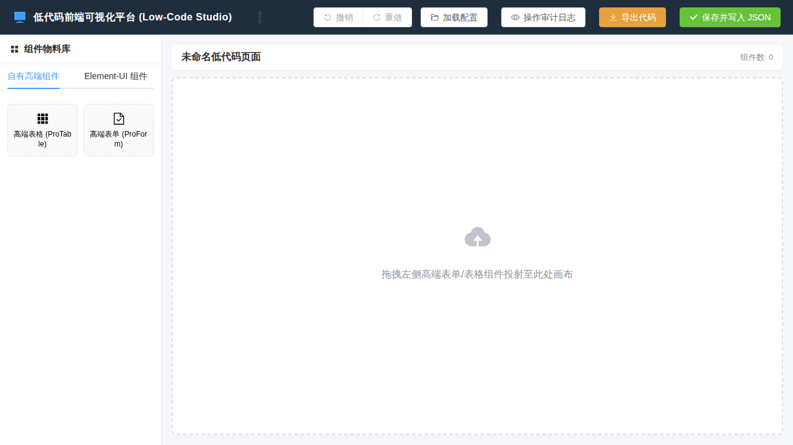
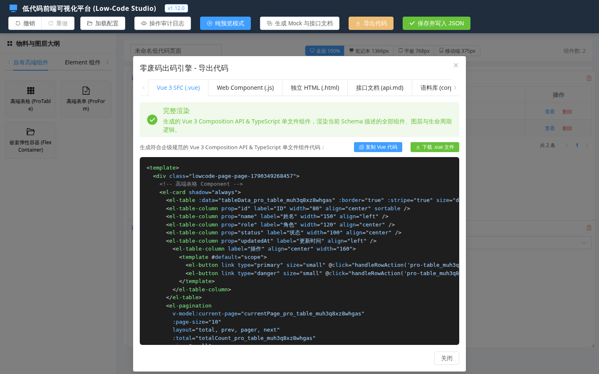
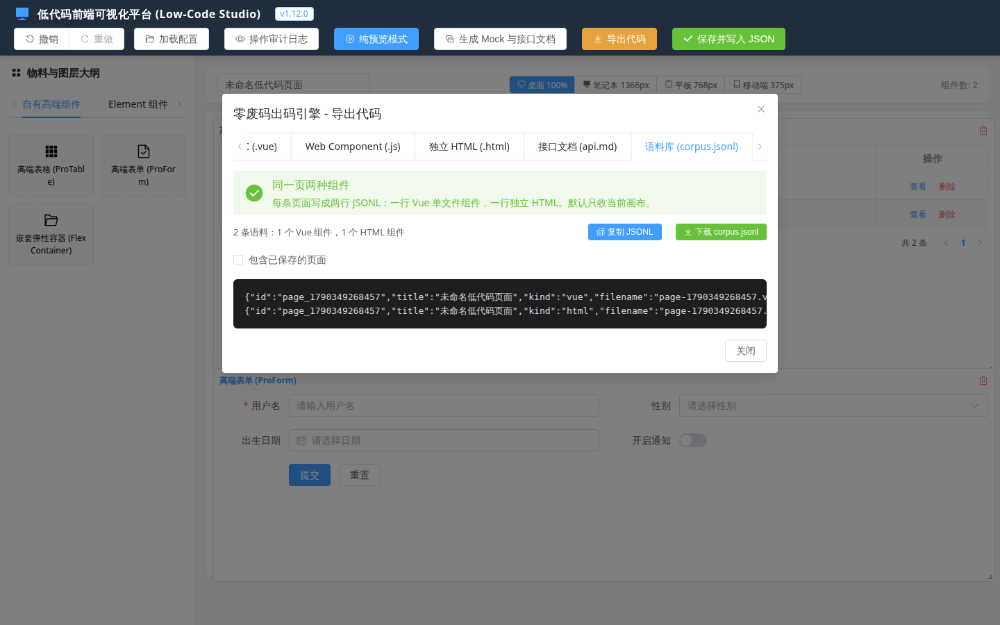
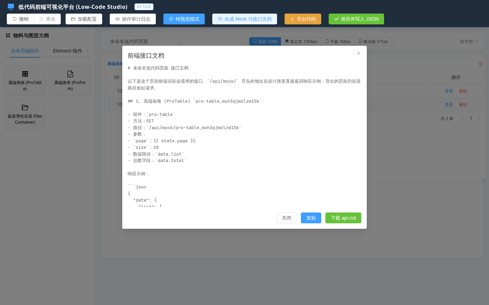

# 低代码前端可视化平台

拖拽搭页面，再导出成能运行的前端代码。当前版本 **v2.1.0**。

页面在设计器里是一份 JSON Schema。表格、表单和按钮都由这份 Schema 渲染。导出时，同一份 Schema 生成 Vue 单文件组件、独立 HTML，以及由这两种组件组成的语料库。平台不生成后端业务代码。页面 JSON 存在本地文件里，SQLite 只记操作日志。

---

## 界面

拖入高端表格和高端表单后的画布。左侧是物料，中间是网格，顶栏负责预览、Mock、导出和保存。



表单项在属性抽屉里配置。可以改字段名、控件类型、必填、占位提示，并上移下移。表格列用同一套方式调整。



纯预览去掉拖拽手柄和删除按钮，页面上的表格、表单和按钮仍可操作。



导出对话框里的 Vue 单文件组件，和画布使用同一份占位、标签宽度和分页配置。旁边还有 Web Component 和独立 HTML。



语料库把当前页面写成两行 JSONL：一行 Vue 组件，一行 HTML 组件。也可以并入已经保存的页面。



还没填地址的表格和表单，可以一键补上 `/api/mock/` 数据源，并写出前端实际会请求的接口说明。



---

## 能做什么

- **拖拽搭页面**：网格画布上拖入、缩放、对齐。物料包括高端表格、高端表单，以及按钮、输入框、卡片、标签、警告、开关、分割线。
- **改配置而不是改代码**：列、表单项、显隐条件、页面初始状态和事件动作都写在 Schema 里。
- **出三种前端产物**：Vue 3 单文件组件、配套的 Web Component，以及用 CDN 就能打开的 HTML。
- **导出语料库**：`corpus.jsonl` 里每个页面各有一条 Vue 记录和一条 HTML 记录。
- **对接已有接口**：组件绑定 `apiBinding` 后，设计器和导出页面都用浏览器 `fetch` 取数。没有地址时可以生成 Mock，并附上接口文档。
- **页面可以收尾**：改标题、保存、载入、删除、恢复上一份备份。撤销和重做覆盖拖拽和属性修改。
- **生成即物料（自我循环）**：画布上选中任意组件组，一键打包为自定义物料；物料可拖拽复用、导出自描述代码（Vue / HTML 内嵌物料定义）、再导入还原——平台能消化自己生成的产物。
- **黑盒物料与版本管理**：物料可打包为"黑盒"（带 inputs/outputs 契约与不可变版本）。实例锁定具体版本、显式升级/回滚；发布新版本、差异对比、归档、fork、批量升级实例一应俱全。
- **本地保存**：Schema 写到 `backend/storage/pages/*.json`。保存、删除和恢复记在 SQLite。

管道编排、远程物料、协同和登录不在当前版本里，规划见 `docs/roadmap/`。

### 🔜 规划中的核心能力（详见 `docs/`）

- **Component - API - Event (CAE) 三角解耦模型**：REST 数据源、最小动作链、物料黑盒引用与版本契约已实现；GraphQL、Event Flow Orchestrator 仍规划中。
- **数据与事件管道编排 (Pipeline Orchestration)**：`beforeTransform` / `asyncFetch` / `scriptTransform` / `afterTransform` 生命周期管道、页面路由跳转 — 规划中。
- **物料市场 / 远程物料 SDK**（v2.2）、**Module Federation 远程物料插件**、**可视化逻辑流编排** — 规划中。

---

## 🎯 核心理念与范围边界 (Core Principles & Scope Guardrails)

> **本节是项目的"宪法"**：新增功能前先对照。**任何不服务于核心命题的功能都属于过度扩展。**

### 一句话核心命题

**把可视化搭出来的页面，变成结构清晰、可运行、可再次被平台消化的前端代码。**

### 四条核心理念

1. **JSON 是唯一事实来源 (Single Source of Truth)** —— 画布、属性、事件、数据源、图层全部是一份可序列化 Schema；一切能力都必须能落到 Schema 上，且 Schema 可往返（保存 / 载入 / 出码 / 导入）。
2. **产物可运行、可读、可往返** —— 导出的是能直接跑的 Vue / HTML，不是不可读的中间产物；导出物自描述（内嵌 `@lowcode-material`），可被平台重新导入，即平台能"消化"自己的产物。
3. **零废码、不写后端业务代码** —— 平台只做前端可视化与出码；不生成后端业务逻辑，不做运行时黑盒引擎（表达式走受限解释器，绝不 `eval` / `new Function`）。
4. **安全与容错默认开启** —— 受限表达式白名单、DOMPurify、Zod 落盘校验、原子写 + 写队列、悬空引用安全跳过；任何落盘 / 导入 / 渲染都不应让页面崩溃。

### 核心功能（必须护住的护城河）

| 能力 | 归属 |
| :--- | :--- |
| 拖拽画布 + 物料（内置 + 自定义） | v1.x |
| 属性 / 事件动作链 / 数据源绑定 | v1.x |
| 多目标出码（Vue SFC / Web Component / HTML）+ 语料库 | v1.x |
| 自我循环物料（打包 / 自描述导出 / 导入还原） | v2.0 |
| 黑盒引用 + 契约 (inputs / outputs) | v2.1 |
| 物料版本管理（草稿 / 不可变发布 / 锁定 / 升级 / 回滚 / 差异 / fork） | v2.1 |
| 本地持久化 + SQLite 审计 + 引用保护 | v1.x–v2.1 |

### 明确非目标（禁止在本项目主线扩展）

- ❌ **后端业务逻辑生成**（BFF / CRUD 脚手架）—— 不是本项目职责
- ❌ **通用运行时渲染引擎**（在线执行任意第三方组件源码 / `vue3-sfc-loader` 动态编译）—— 超出 v2.x 边界，留待单独评估
- ❌ **多人实时协同 / RBAC / SSO** —— 归 v3.0 企业版
- ❌ **数据库 / 云存储 / 发布流水线** —— 归 v3.0 企业版
- ❌ **为单个业务场景定制的专用组件** —— 应由用户以"自定义物料"自行打包，不进内置物料
- ❌ **表达式求值引入 `eval` / `new Function`** —— 安全红线，绝不触碰

### 新增功能的准入检查（每次扩展前自问）

1. 它是否服务于"JSON 桥梁 + 可运行产物"这一核心命题？
2. 它是否能用现有 Schema / 物料 / 版本模型表达，而非新增一套并行机制？
3. 它是否会在产物里引入不可读或不可往返的内容？
4. 它是否越过了上面的"非目标"清单？
5. 任一答案为"否"或"是"，先立项讨论，不要直接写代码。

> **版本节奏**：`0.x → 1.x` 打基础，`2.x` 做闭环与治理，`3.x` 才考虑企业级。**主线只做闭环内的打磨；企业级与生态放到对应大版本。**

---

## 🏗️ 架构设计哲学 (Architecture)

### 1. JSON 桥梁模型 (The JSON Bridge Concept) ✅

平台通过监听用户的拖拉拽与属性配置操作，实时构建并维护一个可序列化的 **JSON 树**。JSON 既是视图渲染的凭证，也是连接组件、接口与事件的唯一桥梁。

核心属性 Key 规范：

- `id`: DOM ID 与画布节点的全局唯一标识。✅
- `component`: 对应的 UI 组件 / 物料类型。✅
- `name`: 对应的表单项属性 / 数据绑定 Key。🟡 (基础表单字段已用)
- `click`: 点击事件动作链（刷新数据、开关弹窗、消息、写入 state）。✅
- `functions`: 对应作用域/域下的逻辑处理函数与业务脚本。🔜 规划中

### 2. Component - API - Event (CAE) 三角解耦模型 🟡 最小闭环 + 物料黑盒/版本已落地

> 组件渲染、`apiBinding` 数据源和 click 动作链已经接通。GraphQL、可视化流程编排和完整管道仍按下方蓝图演进。

```text
                     +----------------------------------+
                     |        页面全局状态中枢          |
                     |       (Pinia / Reactive State)   |
                     +----------------------------------+
                                ▲            │
             状态监听 / 参数映射  │            │ 驱动重新渲染 / 属性透传
                                │            ▼
       +--------------------------------------------------------------+
       |                                                              |
       |  【组件层: Component Node】  ◄───────  【接口层: API Data】  |
       |  - ProTable (高端表格)                 - RESTful / GraphQL   |
       |  - ProForm (高端表单)                  - JSON Path 提取      |
       |  - Element UI 元素                      - 入参 / 出参转换     |
       |                                                              |
       +--------------------------------------------------------------+
                                ▲            │
                       抛出事件  │            │ 执行动作链
                      (Event)   │            ▼ (Action Chain)
                       +--------------------------------+
                       |   【事件动作层: Event/Action】  |
                       |   - Event Trigger              |
                       |   - Action Dispatcher          |
                       |   - Event Flow Orchestrator    |
                       +--------------------------------+
```

---

## 🛠️ 技术栈选型

| 层级              | 技术选型              | 版本/组件        | 说明                                               |
| :---------------- | :-------------------- | :--------------- | :------------------------------------------------- |
| **前端框架**      | Vue 3                 | `3.5+`           | Composition API 及 `<script setup>` 范式           |
| **UI 组件库**     | Element Plus          | `2.x`            | 企级 UI 物料与高端表单/表格（按需引入）            |
| **拖拽布局引擎**  | vue3-grid-layout-next | `1.x`            | 基于栅格网格的可伸缩拖拽布局插件                   |
| **状态管理**      | Pinia                 | `4.x`            | 响应式 Store，管理设计器全局 Schema 状态           |
| **前端构建**      | Vite                  | `8.x`            | 极速冷启动与 HMR 构建工具（rolldown 内核）         |
| **表达式求值**    | 自研受限解释器        | —                | `{{ }}` 表达式安全求值（拒绝 eval / new Function） |
| **HTML 消毒**     | DOMPurify             | `3.x`            | 自定义 HTML 写入 iframe 文档前消毒                 |
| **后端运行环境**  | Node.js               | `20+` / `22+`    | JavaScript 运行环境（CI 覆盖 20 与 22）            |
| **后端 Web 框架** | Express               | `4.x`            | RESTful API 服务框架                               |
| **Schema 校验**   | Zod                   | `4.x`            | 页面 Schema 落盘前结构强校验与字段长度限制         |
| **JSON 文件存储** | Node File System      | `fs/promises`    | 持久化存储 Schema JSON 配置文件                    |
| **日志数据库**    | SQLite                | `better-sqlite3` | 本地轻量级审计日志数据库                           |
| **共享类型**      | `@lowcode/shared`     | —                | Monorepo 共享类型包，消除前后端类型漂移            |
| **单元测试**      | Vitest                | `4.x`            | 前端与后端：Store / 出码 / 表达式 / 数据源 / 存储  |
| **代码规范**      | ESLint + Prettier     | `10.x` / `3.x`   | 0 error / 0 warning，统一代码风格                  |
| **CI/CD**         | GitHub Actions        | —                | 双 Node 版本：typecheck → lint → test → build      |
| **工程化 & 规范** | TypeScript            | `6.x`            | 前后端与 shared 使用同一主版本                     |

---

## 📂 项目工程目录结构

```text
low-code-platform/
├── .github/workflows/      # GitHub Actions CI（typecheck → lint → test → build）
├── docs/                   # 文档集
│   ├── implemented/        # 技术规范 (CAE/物料/组件 I/O/管道编排) 与优化报告
│   └── roadmap/            # 各版本规划与路线图 (0.x ~ 3.0.0，含 v1.3.0 至 v2.1.0)
├── shared/                 # 共享类型包 @lowcode/shared（纯类型，前后端共用）
│   └── src/index.ts        # ComponentNode / PageSchema / MaterialManifest / MaterialVersion ...
├── frontend/               # Vue 3 前端低代码设计器工程
│   ├── src/
│   │   ├── components/     # 设计器 UI (CanvasContainer, MaterialList, PropertyDrawer, MaterialManager ...)
│   │   ├── registry/       # 内置物料种子 (materials.ts) + 运行时注册表 (materialRegistry.ts) + 节点类型 (nodeTypes.ts)
│   │   ├── stores/         # Pinia 全局设计器 Store (designerStore.ts)
│   │   ├── utils/          # 出码 (codeGenerator.ts) / 物料 (materialPacker, materialImport, materialResolver, materialInject) / 表达式 / 数据源
│   │   ├── types/          # 类型 re-export（统一来自 @lowcode/shared）
│   │   ├── *.test.ts       # Vitest 单元测试（Store / 出码 / 物料循环 / 版本解析 ...）
│   │   └── App.vue         # 主应用与 API 联调界面
│   ├── .env / .env.example # VITE_API_BASE 环境变量
│   ├── eslint.config.js    # ESLint flat config（vue + TS + prettier 协调）
│   ├── vitest.config.ts
│   ├── package.json
│   └── vite.config.ts      # unplugin 按需引入 + vendor 分包
├── backend/                # Node.js + Express 后端服务工程
│   ├── src/
│   │   ├── controllers/    # Schema CRUD / 物料与版本控制器 (materialController.ts)
│   │   ├── middleware/     # X-Api-Key 认证
│   │   ├── db/             # SQLite logs.db 初始化脚本
│   │   ├── services/       # 存储 (storageService/materialService/materialVersionService) + 引用扫描 / 批量升级
│   │   ├── utils/          # JSON Patch 审计差异 + 版本判定 (versionClassify.ts)
│   │   ├── validation/     # Zod 落盘强校验 (schemaValidation.ts / materialValidation.ts)
│   │   └── server.ts       # Express 服务入口
│   ├── storage/            # JSON 文件持久化存储目录
│   │   ├── pages/          # 页面配置 JSON 集合 (*.json)
│   │   ├── components/     # 组件配置 JSON 集合 (*.json)
│   │   └── materials/      # 物料目录：<id>/{manifest.json, draft.json, versions/<v>.json}
│   ├── data/               # SQLite 数据库存储目录 (logs.db)
│   ├── eslint.config.mjs   # ESLint flat config（TS + prettier 协调）
│   ├── package.json
│   └── tsconfig.json
├── package.json            # Root Monorepo 脚本（build / test / lint / typecheck）
└── README.md
```

---

## 🚀 快速开始与开发指南

### 1. 安装依赖

```bash
# 在项目根目录下安装所有 Workspaces 依赖
npm install
```

### 2. 启动开发服务器

```bash
# 启动后端 REST API 服务 (运行于 http://localhost:3001)
npm run dev:backend

# 启动前端 Vite 低代码设计器 (运行于 http://localhost:5173)
npm run dev:frontend
```

### 3. 构建与打包

```bash
# 对前端与后端同时进行 TypeScript 类型检查与生产编译打包
npm run build
```

### 4. 质量检查（CI 同款命令）

```bash
npm run typecheck   # 前后端类型检查
npm run lint        # ESLint（0 error / 0 warning 门槛）
npm run test        # Vitest：前端 137 项 + 后端 43 项
npm run format      # Prettier 全仓格式化
```

---

## 🔌 后端 RESTful API 接口定义

| 请求方式   | 路径                       | 描述                                                                                          | 参数 / Body                       |
| :--------- | :------------------------- | :-------------------------------------------------------------------------------------------- | :-------------------------------- |
| **GET**    | `/api/schemas`             | 获取页面/组件 JSON 列表                                                                       | `?type=page` 或 `?type=component` |
| **GET**    | `/api/schemas/:id`         | 读取指定 ID 的 Schema 内容                                                                    | `?type=page`                      |
| **POST**   | `/api/schemas`             | 保存 Schema 至本地 `.json` 文件并记录 SQLite 日志（落盘前 Zod 结构强校验 + 脚本字段长度上限） | Body: `PageSchema` JSON 对象      |
| **DELETE** | `/api/schemas/:id`         | 删除 Schema 配置文件并记录 SQLite 日志                                                        | `?type=page`                      |
| **GET**    | `/api/logs`                | 查询 SQLite 操作审计日志                                                                      | `?pageId=xxx` (可选)              |
| **GET**    | `/api/schemas/:id/backups` | 列出该 Schema 的备份代数                                                                      | `?type=page`                      |
| **POST**   | `/api/schemas/:id/restore` | 从指定备份代恢复                                                                              | Body: `{ "index": 1 }`            |

### 物料与版本管理 (v2.0 / v2.1)

| 请求方式   | 路径                                | 描述                                                       | 参数 / Body                                      |
| :--------- | :---------------------------------- | :--------------------------------------------------------- | :----------------------------------------------- |
| **GET**    | `/api/materials`                    | 物料清单（兼容 v2.0 单文件与 v2.1 目录结构）               | —                                                |
| **POST**   | `/api/materials`                    | 注册物料；携带 `contract` 的黑盒物料走目录结构并发布首版   | Body: `MaterialManifest`                         |
| **GET**    | `/api/materials/:id`                | 物料详情                                                   | —                                                |
| **DELETE** | `/api/materials/:id`                | 删除物料（被引用时返回 409，需 `?force=true`）             | `?force=true` (可选)                             |
| **GET**    | `/api/materials/:id/refs`           | 引用计数与引用页面列表                                     | —                                                |
| **PUT**    | `/api/materials/:id/draft`          | 保存草稿（编辑态，不产生版本）                             | Body: `MaterialVersion`                          |
| **DELETE** | `/api/materials/:id/draft`          | 丢弃草稿                                                   | —                                                |
| **GET**    | `/api/materials/:id/versions`       | 版本列表（版本号 / 发布时间 / 契约签名 / 引用数）          | —                                                |
| **POST**   | `/api/materials/:id/versions`       | 发布：草稿 → 不可变版本（服务端判定建议版本号）            | Body: `{ draft, suggestedVersion? }`             |
| **GET**    | `/api/materials/:id/versions/:v`    | 指定版本详情                                               | —                                                |
| **GET**    | `/api/materials/:id/versions/:v/diff` | 两版本差异（契约层 + 结构层）                            | `?base=:b`                                       |
| **DELETE** | `/api/materials/:id/versions/:v`    | 归档版本（当前版本不可归档，被引用需 `?force=true`）       | `?force=true` (可选)                             |
| **POST**   | `/api/materials/:id/rollback`       | 回滚：历史版本设为当前                                     | Body: `{ "version": "1.0.0" }`                   |
| **POST**   | `/api/materials/:id/fork`           | 从指定版本派生新物料                                       | Body: `{ fromVersion, newType, label, icon }`    |
| **POST**   | `/api/pages/upgrade-material`       | 批量升级：改写页面中引用某物料旧版本的实例                 | Body: `{ materialId, fromVersion, toVersion }`   |

配置了环境变量 `API_KEY` 后，以上接口要求请求头 `X-Api-Key`。`CORS_ORIGIN` 默认 `http://localhost:5173`，`HOST` 默认 `127.0.0.1`。

`VITE_API_KEY` 会打进前端包，只适合挡住对本机端口的随意扫描，不能当作用户口令或服务端机密。未配置 `API_KEY` 时接口保持开放，方便本地开发。

---

## 📝 版本变更历史 (Changelog)

### 📌 v2.1.0 (2026-09)

- **黑盒引用**：复合物料可打包为"黑盒"（`materialRef` 单一实例节点），渲染/出码按引用解析物料定义；实例本身可作为事件目标。
- **契约 (inputs / outputs)**：打包黑盒时自动生成契约——inputs 声明注入点（nodeId + 字段路径），outputs 声明事件出口；属性面板可配置 inputs 值并在「事件」面板为 outputs 绑定动作链。
- **版本管理**：每个物料独立版本线；**草稿 + 不可变发布版本**（发布后永不改写）。版本号自动判定（契约签名变化 = major / 结构增删 = minor / 纯值变化 = patch）。
- **实例锁定与升级**：实例默认 `pin` 具体版本，可选 `follow-minor` / `follow-patch`；版本切换（升级/回滚）、差异对比（契约层 + 结构层）、归档、fork、批量升级实例。
- **引用保护**：删除被引用物料 / 归档被引用版本会被阻止（附引用列表）；缺版本容错回退当前版本并渲染占位，页面不崩溃。
- **存储与接口**：`materials/<id>/{manifest.json, draft.json, versions/<v>.json}`，兼容 v2.0 单文件惰性迁移；`/api/materials/:id/{versions,draft,rollback,fork,refs}` + `/api/pages/upgrade-material`，全部 Zod 校验 + SQLite 审计。

### 📌 v2.0.0 (2026-09)

- **自我循环物料机制**：画布上任意组件组可一键打包为自定义物料，出现在「自定义物料」面板。
- **拖拽复用**：自定义物料拖入画布即实例化为等价子树（坐标平移 + id / 事件引用重写，多选 + Ctrl/Shift 追加选择）。
- **自描述出码**：物料导出 Vue / 独立 HTML 时内嵌 `@lowcode-material` 定义注释块——导出文件 = 可运行代码 + 可导入物料定义。
- **导入还原**：物料管理支持导入 `.json` / `.vue` / `.html`（内嵌注释块零猜测还原；无注释的第三方源码降级为空快照物料并提示）。
- **循环幂等**：打包 → 出码 → 导入 → 再打包 结构逐轮稳定（`instantiate(package(nodes)) ≅ nodes` 回归测试锁定）。
- **物料治理**：运行时注册表（`custom-` 命名空间隔离、内置物料只读）、后端 `/api/materials` CRUD + Zod 强校验（前缀 / 长度 / 节点数 / 嵌套深度）+ SQLite 审计、物料管理器（导入 / 导出 / 编辑 / 删除）。

### 📌 v1.12.0 (2026-09)

- **语料库导出**：同一页面写成 JSONL 里的两行，一行是 Vue 单文件组件，一行是独立 HTML。默认收当前画布，也可以并入已保存页面。

### 📌 v1.11.0 (2026-09)

- **出码跟画布用同一份配置**：表单占位提示、必填、标签宽度和内联布局会写进 Vue 组件、Web Component 配套组件和独立 HTML。
- **表格不再另写一套**：分页大小跟配置走，请求参数使用同一个 `size`。没有行按钮时不再补一列「查看」。

### 📌 v1.10.0 (2026-09)

- **改数据源不再丢掉 Mock**：打开组件或修改参数时，地址没变就保留响应示例。参数还不是合法 JSON 时，沿用上次保存的参数并给出提示。
- **配置可以排序**：表格列和表单项可以上移、下移，表单项可以改占位提示。画布按这个顺序渲染。
- **抽屉不再挡住顶栏**：顶栏按钮在属性面板打开时仍可点击。设计器界面和抽屉里的选项改为中文。

### 📌 v1.9.0 (2026-09)

- **一键 Mock**：还没填地址的高端表格和高端表单会补上 `/api/mock/` 数据源。设计器直接返回响应示例，已有地址不会被覆盖。出码仍只请求该路径，不把示例写进脚本。
- **接口文档**：同一操作和导出对话框都会给出方法、路径、参数和响应示例，可复制或下载 `api.md`。

### 📌 v1.8.0 (2026-09)

- **已保存页面可收尾**：画布上可以直接改标题。载入读取完整 Schema。列表里可以删除，也可以恢复上一份备份。
- **纯预览不再露出搭建控件**：预览时不能拖拽、缩放或删除组件，按钮和表单仍然可以操作。退出预览后编辑能力恢复。
- **下拉选项可编辑**：表单 Select 可以增删选项的显示文字和值，设计器与出码使用同一份选项。

### 📌 v1.7.0 (2026-09)

- **表单必填拦截提交**：输入框、下拉框和日期为空时，设计器和导出页面都停住并指出未填项；填完才执行 `submit` 动作。开关的 `false` 不算未填。
- **按表达式显隐**：组件可写 `{{ state.show === true }}`。无法安全求值的表达式保持显示，不会写进生成代码。
- **动作按条件跳过**：动作上的 `when` 为假时跳过这一条，后面的动作继续执行。
- **页面初始状态**：物料面板可以增删改 `state` 的键和 JSON 值，显隐和动作立刻按新值求值。

### 📌 v1.6.0 (2026-09)

- **出码不再被用户字符串打断**：URL 换行留在注释里，非法属性名丢弃，样式值去掉会闭合声明的字符。
- **多表单按 id 分支**：提交和重置按 `formId` 取对应表单数据；输入框和开关各自声明数据。
- **表格占位与分页**：未绑定数据源时设计器和出码使用同一组占位行；导出页面翻页会再次请求。
- **行操作与弹窗载荷**：表格行按钮执行对应事件动作链；打开弹窗时把载荷写入页面状态。
- **表达式与图层初始可见性**：能通过白名单的 `{{ }}` 内联进模板，其余保持转义字符串；新建弹窗和 Loading 默认隐藏，导出初始值跟 `layer.visible`。
- **粘贴、变量名与存储**：粘贴重写子孙 id；页面级标识符冲突时加短哈希；页面和组件备份分目录，版本递增和删除走同一写队列。
- **请求与状态写入**：跟随重定向时重新检查每一跳；`__proto__` 等键不会写进页面状态。
- **自定义 HTML 与密钥比较**：设计器和出码共用同一份 srcdoc 清洗；启用 `API_KEY` 时用哈希后的定长时间比较。`VITE_API_KEY` 会打进前端包，不是用户口令。
- **审计差异与撤销**：第二次保存记下 JSON Patch；拖拽松手记一步，历史栈以快照加补丁存储。
- **组件入参提示**：表格列、表单项、容器标题缺失时抽屉给出警告，不拦截保存。

### 📌 v1.5.0 (2026-09)

- **出码表达式白名单**：只有受限解释器能完整解析的 `{{ }}` 才会内联进生成代码；响应路径只接受标识符和下标，非法片段不会拼进 JavaScript。
- **属性修改可撤销**：直接改属性、数据源和事件时记下变更前快照，连续输入合并成一步；历史栈按体积丢弃最早的快照。
- **大纲跟随当前图层**：进入弹窗或其它图层编辑时，大纲显示该图层的节点树，嵌套子节点可删除。
- **事件目标改为选择**：动作链从组件和图层列表里选目标；某一步失败后停止后续动作。
- **容器内排序**：弹性容器里的子节点可以前移、后移。
- **自定义 HTML 导出隔离**：出码改为 sandbox iframe 的 srcdoc，不再把脚本用 `new Function` 放进页面。
- **数据源请求约束**：仅允许 http(s) 和站内相对路径，拦截云元数据地址，请求 10 秒超时。
- **工具链对齐**：后端与 shared 的 TypeScript 升到 6.x，与前端一致。

### 📌 v1.3.0

- **数据驱动能力**：组件支持 `apiBinding` 接口数据源绑定（URL/方法/参数/响应路径/分页路径/自动请求），设计器"试请求"实时预览，出码产物生成真实前端 `fetch` 调用（不生成后端代码）。
- **表达式绑定真实渲染**：`{{ state.xxx }}` 表达式从属性面板预览升级为画布组件实时求值。
- **事件动作链 (Action Chain)**：组件 `click` 事件可编排动作链（刷新数据 / 打开/关闭弹窗 / Loading 控制 / 消息提示 / 状态更新），页面从展示变为可交互。
- **配套加固**：后端 `X-Api-Key` 认证（可配置开关）、Schema 版本化保存与回滚、备份轮转与恢复接口、并发写保护、嵌套容器递归渲染、导出代码语法高亮、docs 分区、axios 统一错误降级。
- **同一版本内的补强**：主画布与 canvas 图层共用一份 `children`；弹窗出码带上图层内组件；容器可拖入子节点；自定义 HTML 预览改为 sandbox iframe；出码把 HTML/脚本放进转义字符串；备份路径拒绝 `../`；API 默认只监听本机并收紧 CORS。

### 📌 v1.2.0

- **多图层堆叠架构**：新增弹窗 (Dialog)、Loading 遮罩、自定义 HTML 三种业务图层，支持图层显隐切换与 zIndex 层级管理。
- **图层生命周期钩子**：自定义 HTML 图层支持 `onMounted` / `onUpdated` / `onUnmounted` 生命周期脚本注入，实现数据加载、DOM 操作与清理逻辑。
- **出码引擎完整渲染**：Web Component（配套 PageTemplate.vue）与独立 HTML（CDN 渲染）由演示级升级为**完整渲染**。
- **工程化与安全加固**：Vitest 单元测试（59 用例）、ESLint + Prettier（0 error / 0 warning）、GitHub Actions CI、Zod 落盘强校验、受限表达式求值器（移除 `new Function`）、DOMPurify HTML 消毒、`@lowcode/shared` 共享类型包、Element Plus 按需引入（业务代码体积 -95%）、出码输入转义（防注入破坏生成代码）。

### 📌 v1.1.0

- **画布对齐参考线与吸附指示**：拖拽/缩放组件时实时计算与相邻组件的边缘/中心对齐参考线并高亮吸附。
- **键盘方向键微调**：支持方向键 (可组合 Shift 加速) 精确微调选中组件的网格位置。
- **操作审计日志可视化**：操作日志详情支持 JSON 结构化快照查看。

### 📌 v1.0.0 (Base GA)

- **基础正式版发布**：可视化拖拽布局、分类物料库与属性配置抽屉、双通道存储 (JSON 文件 + SQLite 审计) 全链路打通。
- **30 步撤销/重做历史栈**：集成 `Ctrl+Z` / `Ctrl+Y` / `Ctrl+C` / `Ctrl+V` / `Delete` 快捷键。
- **静默 3 分钟自动保存**：无感后台 JSON 保存机制，右下角淡雅加载指示器。
- **多目标出码引擎**：一键生成 Vue 3 Composition API SFC (`.vue`) 源码；Web Component 与独立 HTML 导出当前为**演示级渲染**（规划中升级为完整渲染）。

### 📌 v0.3.0

- **多端响应式视图切换**：画布顶部支持一键切换桌面端 (100%)、笔记本 (1366px)、平板 (768px) 及移动端 (375px) 预览，网格列数自适应缩放。
- **动态 JS 表达式解析**：新增 `frontend/src/utils/expression.ts`，支持组件属性绑定 `{{ ... }}` 动态模板表达式。
- **嵌套弹性容器**：新增 `pro-container` (FlexContainer) 嵌套容器物料，支持组件自由嵌套与布局调整。
- **全项目版本同步**：全量升级 Monorepo (`root`, `frontend`, `backend`) 版本标签至 `v0.3.0`。

### 📌 v0.2.0

- **静默 3 分钟自动保存**：实现无感后台 JSON 保存机制，右下角带有淡雅的加载指示器。
- **多目标零废码出码引擎**：支持一键生成 Vue 3 Composition API SFC (`.vue`)、W3C Web Components (`.js`) 与单页独立 HTML (`.html`)。
- **30 步撤销/重做历史栈**：Pinia 全局撤销/重做支持，集成 `Ctrl+Z` / `Ctrl+Y` / `Ctrl+C` / `Ctrl+V` / `Delete` 快捷键，且自动排除文本输入框焦点。

### 📌 v0.0.1

- **低代码平台基础Scaffold**：搭建基于 Vue 3 + Element Plus + Pinia + `vue3-grid-layout-next` + Node.js + Express + SQLite 的全栈 Monorepo。
- **核心物料与属性抽屉**：实现 `ProTable`（高端表格）、`ProForm`（高端表单）及 Element Plus 原生 UI 物料。
- **存储与审计双通道**：页面 Schema 直接存为本地 `.json` 文件，操作审计日志自动落盘 SQLite (`logs.db`)。

---

## 📄 文档索引 (Documentation Index)

文档按类型分为两个分区，版本规划与技术规范不混放：

- **`docs/implemented/`**：技术规范与优化报告（契约、物料、组件 I/O、管道编排）
- **`docs/roadmap/`**：各版本规划与路线图（含已发布版本的规划记录，以及尚未落地的方向）

### 📘 技术规范 (docs/implemented/)

1. **[Component - API - Event 三角解耦规范](docs/implemented/COMPONENT_API_EVENT_MAPPING.md)**：包含完整的 Schema 契约与 JSON 桥梁模型（部分能力见 v1.3.0 数据驱动实现）。
2. **[低代码物料解析规范与技术对比指南](docs/implemented/MATERIAL_SPECIFICATION.md)**：包含 Vue 源码 (.vue) 与编译 JS (.js) 的解析机制、兼容性、扩展性对比及混合架构最佳落地建议。
3. **[自制组件入参/出参规范与契约强校验指南](docs/implemented/COMPONENT_IO_SPECIFICATION.md)**：包含自制物料组件必填 Inputs/Outputs 参数定义、类型约束、属性抽屉强校验规则。
4. **[数据与事件管道编排技术规范](docs/implemented/PIPELINE_ORCHESTRATION.md)**：包含组件、图层（弹窗/遮罩）、页面路由跳转、生命周期钩子与异步 API 数据流的可视化管道编排架构规范。
5. **[v0.2.0 已实现功能排查与优化报告](docs/implemented/0.2.0_OPTIMIZATIONS.md)**：包含 Web Component Shadow DOM 样式穿透、增量保存、历史栈优化、快捷键上下文隔离与代码美化解析器落地方案。

### 🗺️ 版本规划 (docs/roadmap/)

6. **[0.0.1 里程碑规划](docs/roadmap/0.0.1_PLAN.md)**：包含基础拖拽、属性面板与双存储方案。
7. **[0.1.0 接口与事件联动规划](docs/roadmap/0.1.0_PLAN.md)**：包含 API 数据源绑定、参数映射与事件动作链条。
8. **[架构演进与体验优化深度建议](docs/roadmap/ARCH_RECOMMENDATIONS.md)**：包含零废码源码生成器、沙箱预览、时间旅行撤销历史栈、远程物料插件与规则引擎的落地方案。
9. **[平台演进与优化方向指南](docs/roadmap/FUTURE_DIRECTIONS.md)**：包含画布标尺、可视化联动、微前端发布、协同锁、远程物料等尚未落地的方向。文首标明了 v1.3.0 之前已经完成的条目。
10. **[v0.4.0 功能规划与路线图](docs/roadmap/0.4.0_PLAN.md)**：包含节点式可视化逻辑流编排、在线 API 数据源建模与 Mock 仿真、可视化 CSS 与样式微调编辑器、Schema 版本对比与 Diff 工具、第三方物料 SDK。
11. **[v0.5.0 功能规划与路线图](docs/roadmap/0.5.0_PLAN.md)**：包含多工作区多项目物理隔离、自制组件入参/出参强校验规范、简易操作日志可视化控制台。
12. **[v1.0.0 基础正式版 (Base GA) 规划与路线图](docs/roadmap/1.0.0_PLAN.md)**：包含基础拖拽布局、组件 I/O 契约强校验、JSON 文件存储与 SQLite 审计日志控制台、多目标出码与基础页面发布。
13. **[v1.1.0 体验增强版规划](docs/roadmap/1.1.0_PLAN.md)**：包含画布对齐参考线/吸附指示、键盘方向键微调、操作日志可视化 JSON Diff 比对。
14. **[v1.2.0 多图层架构与生命周期规划](docs/roadmap/1.2.0_PLAN.md)**：包含对话框图层、Loading 加载框图层、自定义 HTML 图层及 JavaScript 生命周期钩子。
15. **[v1.3.0 数据驱动能力与体验加固记录](docs/roadmap/1.3.0_PLAN.md)**：数据源绑定、表达式渲染、事件动作链、E2E、后端认证/版本化/备份轮转。该版本已合入 `main`。
16. **[v1.6.0 正确性与一致性加固](docs/roadmap/1.6.0_PLAN.md)**：出码换行注入、多表单分支、输入框状态、表格占位、行操作与分页、表达式出码、图层可见性、备份隔离、重定向校验、审计差异与撤销补丁。已实现。
17. **[v1.7.0 条件交互](docs/roadmap/1.7.0_PLAN.md)**：表单必填拦截提交、组件显隐表达式、动作条件跳过、页面初始状态面板。已实现。
18. **[v1.8.0 核心闭环收尾](docs/roadmap/1.8.0_PLAN.md)**：页面改名、删除与恢复上一份、纯预览去掉搭建控件、表单下拉选项可编辑。已实现。
19. **[v1.9.0 Mock 与接口文档](docs/roadmap/1.9.0_PLAN.md)**：一键为未填地址的表格和表单补 Mock，并产出前端实际调用的接口文档。已实现。
20. **[v1.10.0 交互打磨](docs/roadmap/1.10.0_PLAN.md)**：编辑数据源时保留 Mock 示例、配置项排序、抽屉不再挡住顶栏。已实现。
21. **[v1.11.0 出码与画布对齐](docs/roadmap/1.11.0_PLAN.md)**：Vue、Web Component 配套组件和独立 HTML 使用画布上的占位、标签宽度、分页和行按钮。已实现。
22. **[v1.12.0 语料库导出](docs/roadmap/1.12.0_PLAN.md)**：同一页面导出为 Vue 组件和 HTML 组件两条语料。已实现。
23. **[v2.0.0 自我循环物料机制规划](docs/roadmap/2.0.0_PLAN.md)**：画布生成物料的自我循环闭环、映射规则、关系模型、自描述出码与导入管道。已实现。
24. **[v2.1.0 物料版本管理与黑盒引用规划](docs/roadmap/2.1.0_PLAN.md)**：黑盒引用、版本发布/锁定/升级/回滚、引用保护与 fork。已实现。
25. **[v2.1.0 版本管理实现解析](docs/roadmap/2.1.0_IMPLEMENTATION.md)**：版本管理的函数级实现方案（存储/判定/解析链/测试）。已实现。
26. **[v3.0.0 远期企业级架构与生态规划](docs/roadmap/3.0.0_PLAN.md)**：包含企业级 RBAC/SSO 单点登录、PostgreSQL/S3 高可用分布式存储、CRDT 多人实时协同、一键 CI/CD 灰度发布、VS Code 插件与 CLI 工具链。
